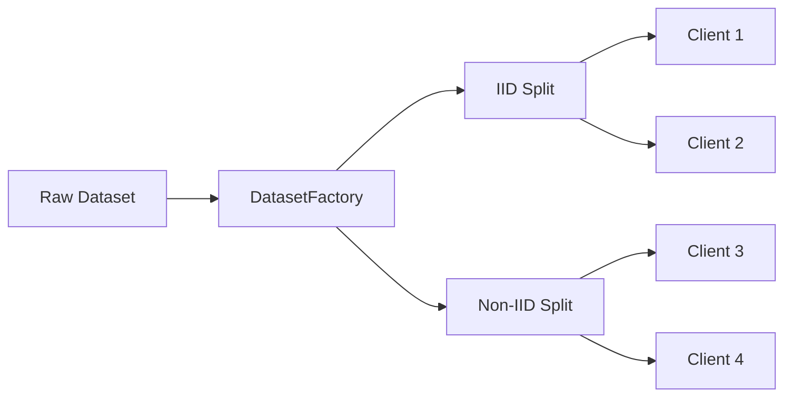
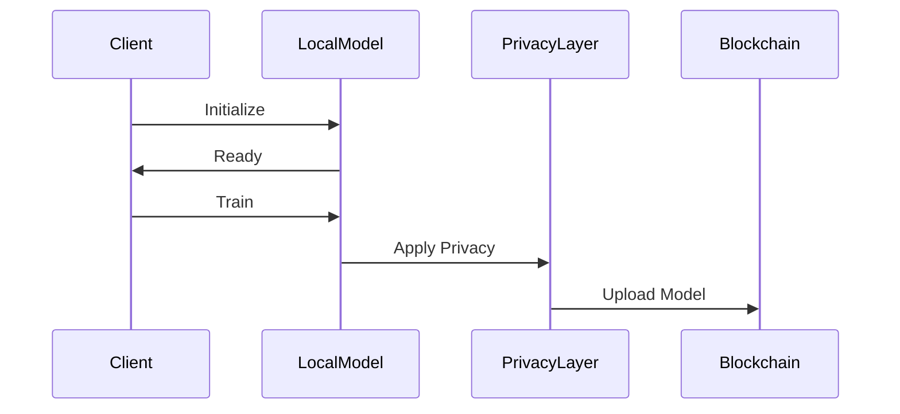
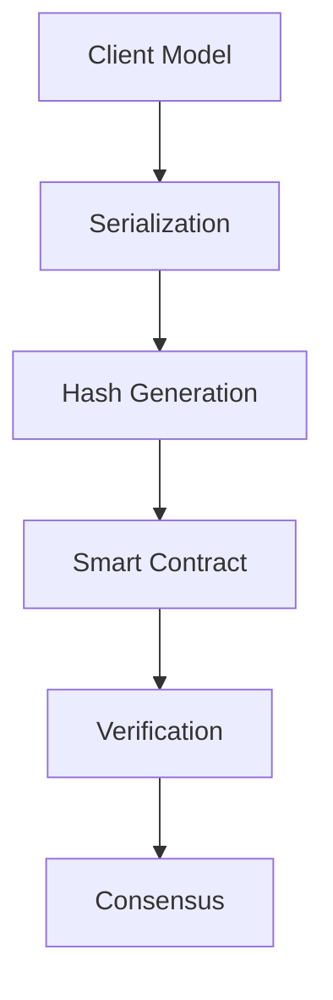
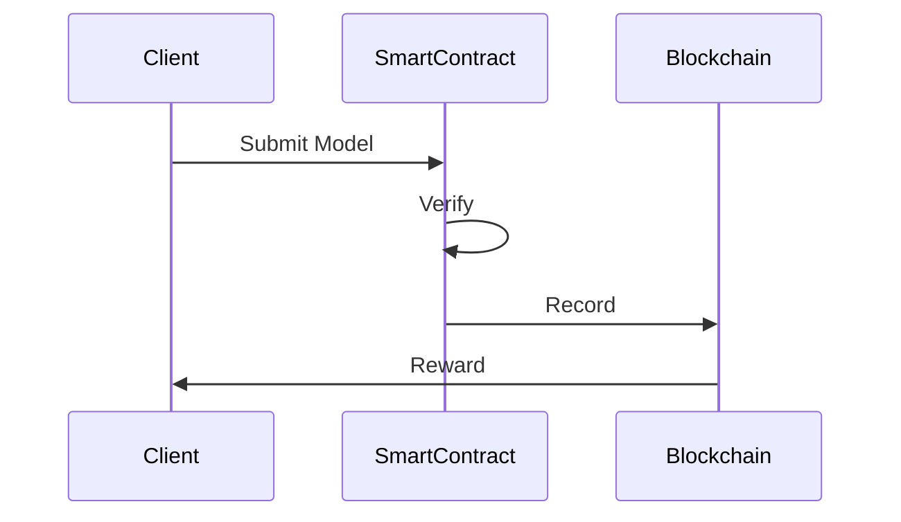

# Data Flow

This document describes how data flows through the DecentraLearn system during federated learning.

## Overview

The data flow in DecentraLearn follows these main paths:

1. Dataset Distribution
2. Model Training Flow
3. Model Verification Flow
4. Privacy-Preserving Updates
5. Incentive Distribution

## 1. Dataset Distribution



Process:
1. Raw dataset is loaded
2. DatasetFactory processes and normalizes data
3. DatasetSpliter distributes data to clients
4. Privacy mechanisms are applied
5. Clients receive their data portions

## 2. Model Training Flow



Steps:
1. Client initializes local model
2. Training on local dataset
3. Privacy mechanisms applied
4. Model state serialized
5. Upload to blockchain

## 3. Model Verification Flow



Process:
1. Model state captured
2. State serialized to JSON
3. Hash generated for verification
4. Smart contract verifies integrity
5. Consensus reached on blockchain

## 4. Privacy-Preserving Updates

Data protection during updates:

1. Differential Privacy
   - Noise addition
   - Parameter clipping
   - Privacy budget tracking

2. Homomorphic Encryption
   - Model parameter encryption
   - Secure aggregation
   - Key management

3. Zero-Knowledge Proofs
   - Model validity proof
   - Training verification
   - Privacy compliance

## 5. Incentive Distribution



Process:
1. Client submits model update
2. Smart contract verifies contribution
3. Update recorded on blockchain
4. Incentives distributed to client

## Data Security

Security measures at each stage:

1. Data at Rest
   - Encrypted storage
   - Access control
   - Audit logging

2. Data in Transit
   - Secure communication
   - Parameter encryption
   - Integrity verification

3. Data Processing
   - Secure computation
   - Privacy preservation
   - Audit trails

## Error Handling

Data flow error handling:

1. Network Failures
   - Retry mechanisms
   - State recovery
   - Consistency checks

2. Privacy Breaches
   - Breach detection
   - Flow termination
   - Recovery procedures

3. Validation Errors
   - Data validation
   - Model verification
   - State consistency

## Best Practices

When implementing data flows:

1. Always verify data integrity
2. Implement proper error handling
3. Monitor privacy budgets
4. Maintain audit trails
5. Follow security protocols

## Configuration

Data flow configuration:

```python
from decentralearn.config import (
    DataFlowConfig,
    PrivacyConfig,
    NetworkConfig
)

config = DataFlowConfig(
    privacy=PrivacyConfig(epsilon=0.1),
    network=NetworkConfig(timeout=30)
)
```

## Monitoring

Monitor data flows through:

1. Logging
   ```python
   from decentralearn.monitoring import DataFlowMonitor
   ```

2. Metrics
   - Data volume
   - Privacy budget
   - Network latency
   - Error rates

## See Also

- [Core Components](components.md)
- [Security Model](security.md)
- [API Reference](../api/README.md) 